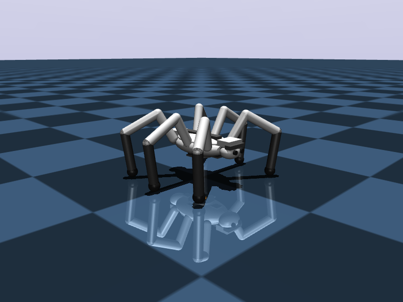
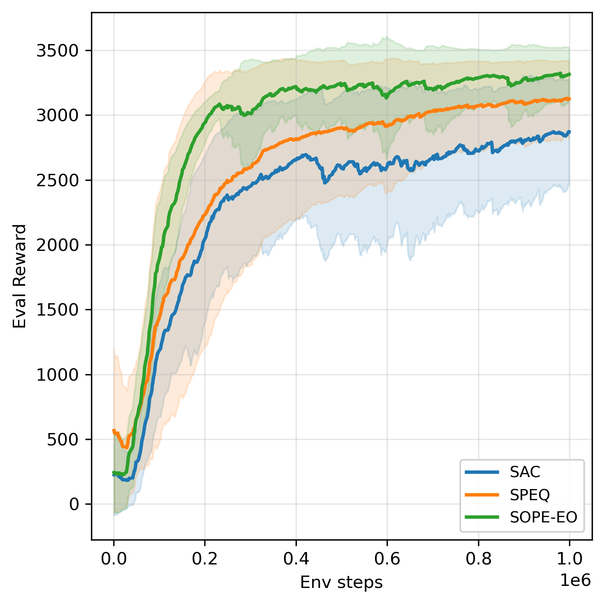
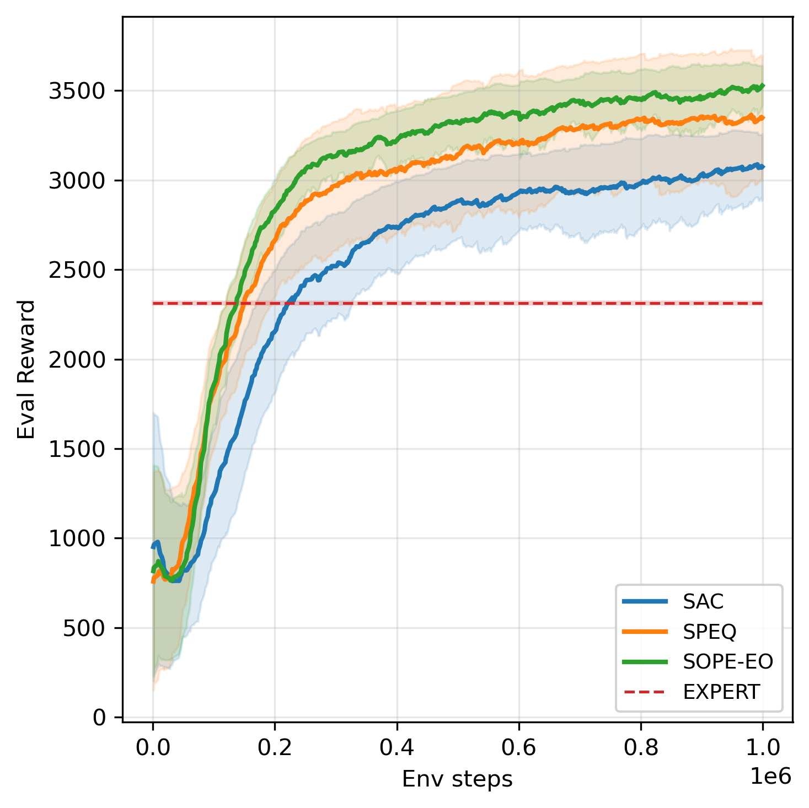
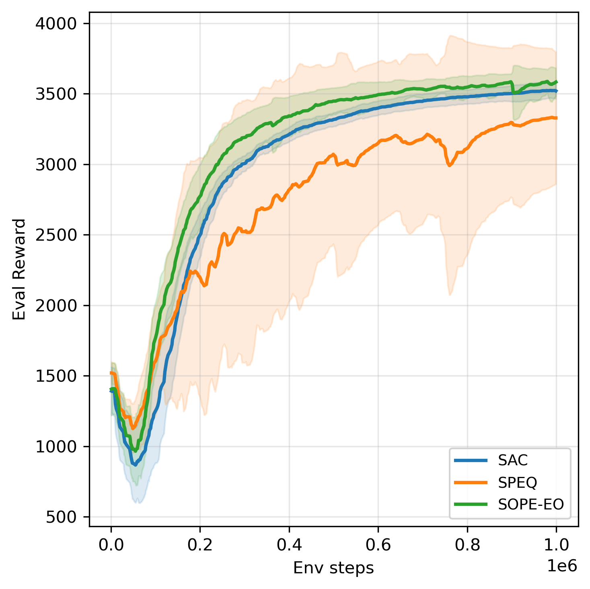
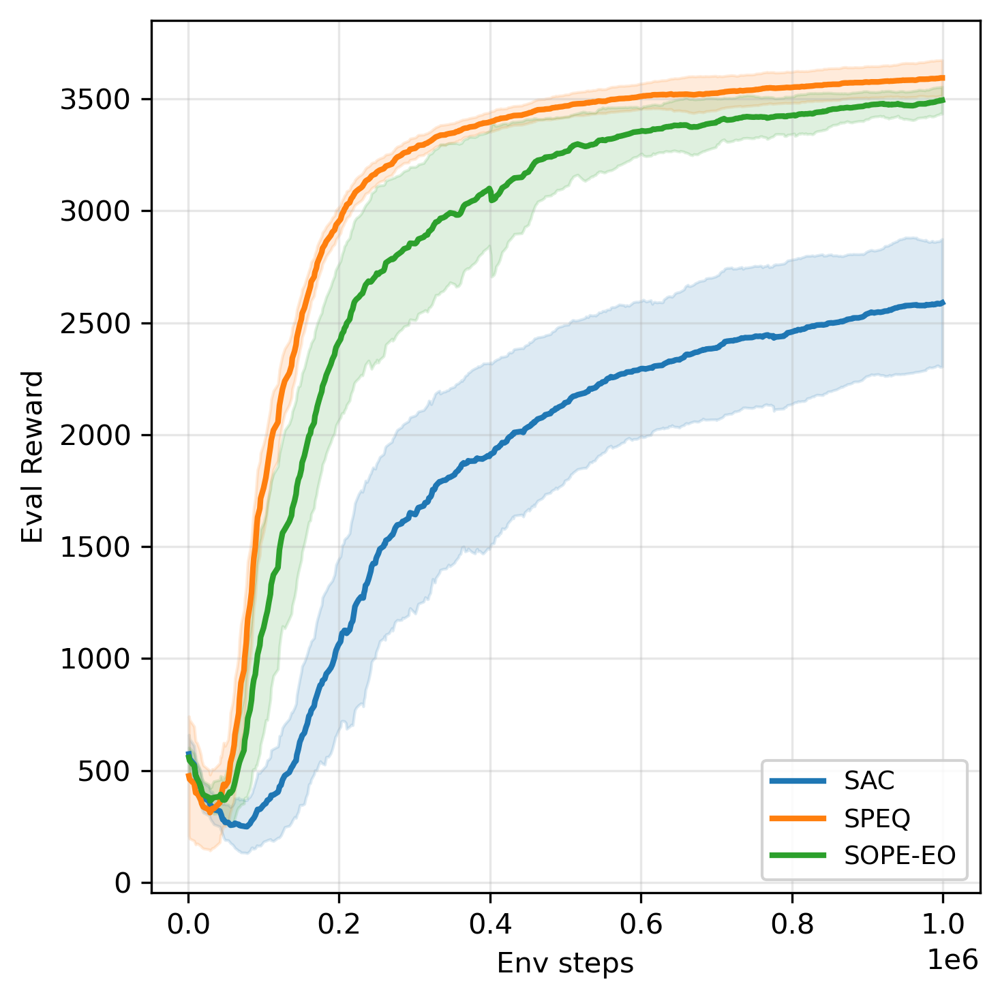
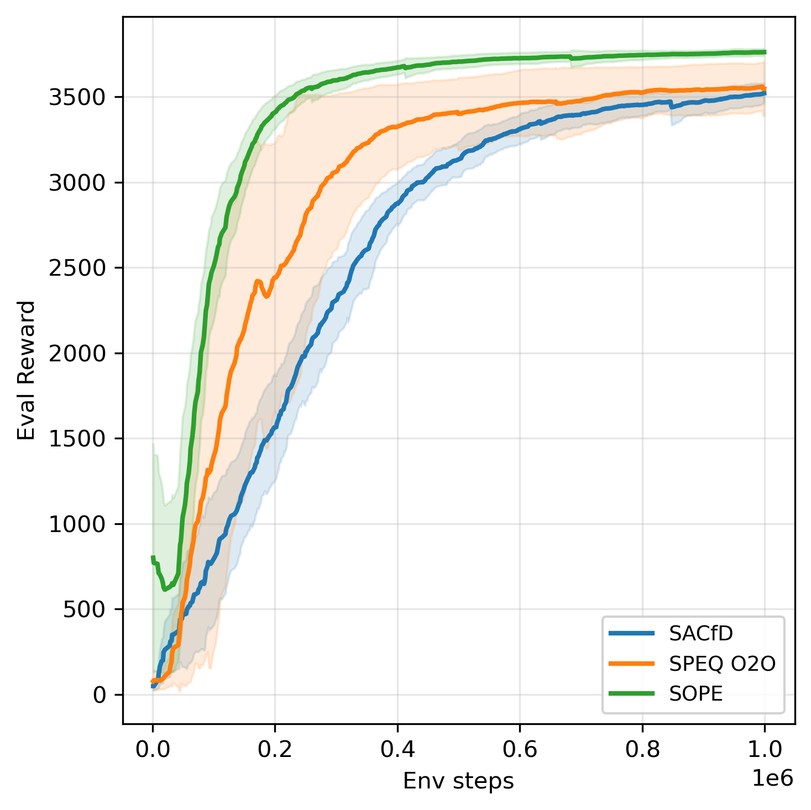
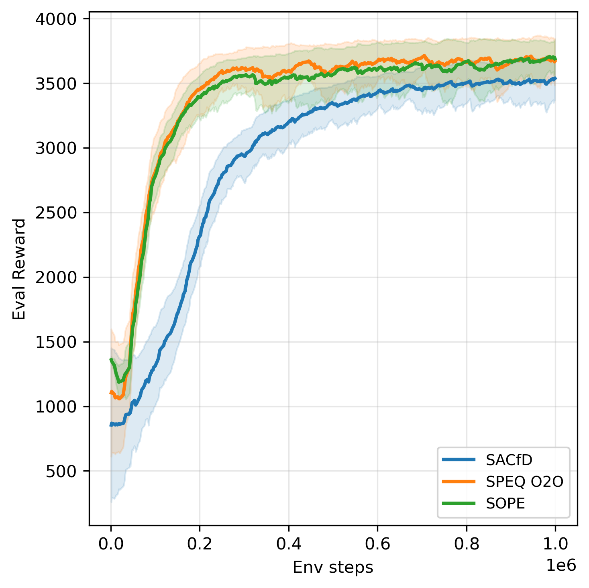
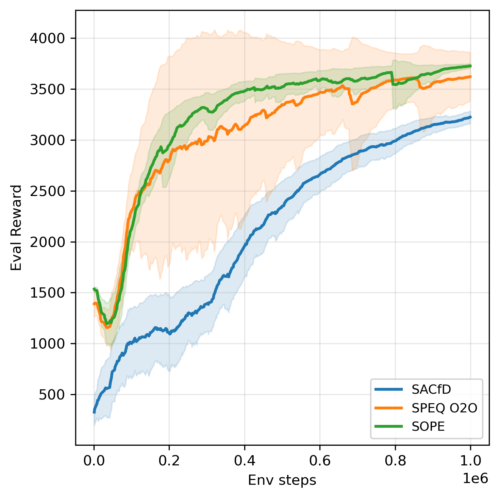
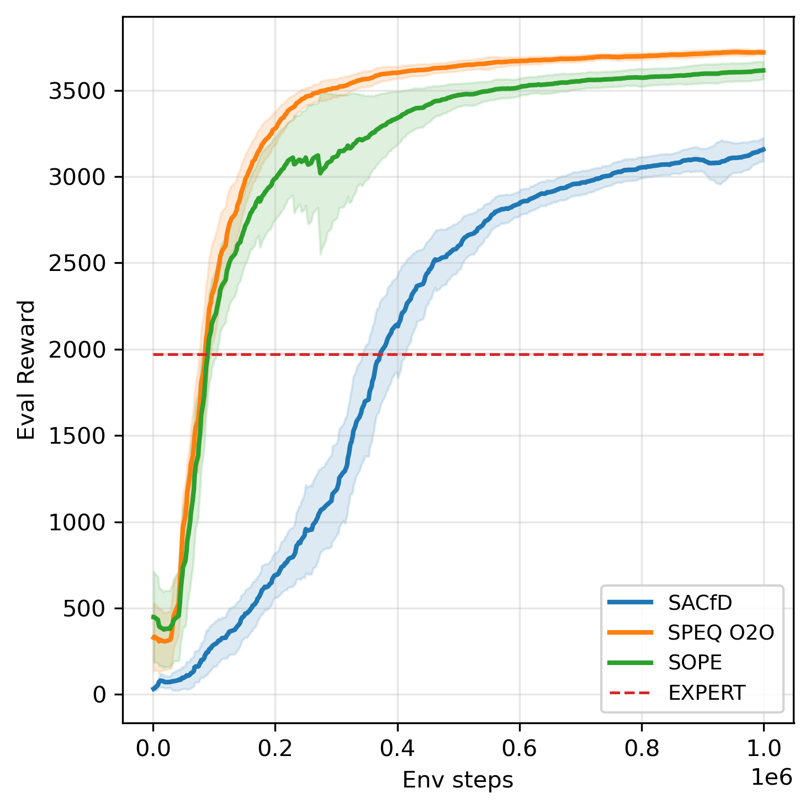

# ARC-RL 🦾

A reinforcement learning playground inspired by the iconic robots from **ARC Raiders**: the Queen, the Bastion, the Leaper and the Tick. Each one is built from scratch in MuJoCo, wrapped in Gymnasium, and ready to learn how to walk, run, and occasionally faceplant.

This is a personal project, fueled by an unreasonable love for the ARC Raiders game. The goals are simple: (a) have fun with robots and RL, and (b) figure out how to teach these deeply weird body plans to move.

---

## 🤖 Meet the cast

<p align="center">
  
  
  
  
</p>

- 👑 **Queen** — 18-DoF hexapod with a regal carapace and a cyan eye that judges you. Heavier and slower; trained with a gait-compliance bonus so she moves with grace instead of flailing. [📹 video](assets/queen.mp4)
- 🛡️ **Bastion** — 12-DoF armored hexapod, low centre of mass, face-mounted barrel for style points. Strict gait clock forces a proper tripod stance. [📹 video](assets/bastion.mp4)
- 🐸 **Leaper** — 12-DoF quadruped, diagonal-pair trot gait. Lighter, faster, and a little chaotic — itching to run straight at your face. [📹 video](assets/leaper.mp4)
- 🪲 **Tick** — 18-DoF compact hexapod with a low stance. Small, scrappy, and built for tight spaces. [📹 video](assets/tick.mp4)

---

## 📦 Installation

```bash
# 1. Create a clean Python 3.11 environment
conda create -n arc_rl python=3.11 -y
conda activate arc_rl

# 2. Clone the repo
git clone https://github.com/CarloRomeo427/ARC_RL.git
cd ARC_RL

# 3. Install Python dependencies
pip install -r requirements.txt
```

MuJoCo ships with `gymnasium[mujoco]`, so no extra setup. Running headless is fine — the code automatically sets `MUJOCO_GL=egl` when there's no display. Tested with Python 3.11 and PyTorch with CUDA.

---

## 🚀 How to launch

```bash
python main.py --algo sac --env queen --log-wandb
```

That's all you need. Switch the environment with `--env {queen, bastion, leaper, tick}` and the seed with `--seed N`. Pick the algorithm with `--algo` from the list below.

### Algorithms

**Online (no prior data)**

| Algo | Paper | Notes |
|---|---|---|
| `sac` | [Haarnoja et al., 2018](https://arxiv.org/abs/1801.01290) | Soft Actor-Critic baseline |
| `droq` | [Hiraoka et al., 2022](https://arxiv.org/abs/2110.02034) | SAC + critic dropout + LayerNorm + UTD=20 |
| `speq` | [Romeo et al., 2025](https://arxiv.org/abs/2501.08669) | Periodic Offline Stabilization Phases over the online buffer |
| `sope_eo` | based on `sope` | Online-only SOPE — periodic offline stabilization phases over the online buffer with adaptive length via OPE-based early stopping |

**Online with prior data** (auto-downloads the expert dataset from [🤗 CarloRomeoHugging/ARC_RL](https://huggingface.co/datasets/CarloRomeoHugging/ARC_RL))

| Algo | Paper | Notes |
|---|---|---|
| `sacfd` | [Vecerik et al., 2017](https://arxiv.org/abs/1707.08817) | SAC from Demonstrations (single fenced buffer) |
| `rlpd` | [Ball et al., 2023](https://arxiv.org/abs/2302.02948) | 10 critics, UTD=20, random subset target, 50/50 sampling |
| `speq_o2o` | based on `speq` | SPEQ with 50/50 online–offline sampling during both training and stabilization |
| `sope` | *coming soon* | Adaptive Stabilization length via an actor-aligned OPE early-stopping signal (replaces SPEQ's fixed-N hyperparameter) |

### CLI flags

| Flag | Default | What it does |
|---|---|---|
| `--algo` | `sac` | **Exclusively Online**: `sac`, `speq`, `sope_eo`, `droq` <br> **Online with Prior data**: `sacfd`, `speq_o2o`, `sope`, `rlpd` |
| `--env` | `queen` | One of `leaper`, `bastion`, `queen`, `tick` |
| `--epochs` | `1000` | Total epochs (1 epoch = 1000 env steps) |
| `--seed` | `0` | RNG seed |
| `--log-wandb` | off | Enable Weights & Biases logging |

Evaluation runs at the end of every epoch; evaluation videos are uploaded to W&B every 10 epochs.

---

## 📈 Performance

All curves are mean ± std over 3 seeds, 1M env steps per run, EMA-smoothed. **DroQ and RLPD are implemented but have not been benchmarked yet due to computational and time constraints.**

### Online (no prior data)

<p align="center">
  
  
  
  
</p>

### Online with prior data

<p align="center">
  
  
  
  
</p>

---

## 💾 Dataset collection

If you want to regenerate the expert demos yourself instead of pulling them from HuggingFace:

```bash
python -m src.utils.collect_dataset.py --env bastion --n-episodes 1000
```

The hand-crafted CPG controllers, used to generate the datasets, ship with the repo.

---

## 📚 Citation

If this code helps you in your research, please cite it — it's much appreciated.

```bibtex
@software{arc_rl_2026,
  author = {Carlo Romeo},
  title  = {ARC-RL: A Reinforcement Learning Playground for ARC-Raiders Inspired Robots},
  year   = {2026},
  url    = {https://github.com/CarloRomeo427/ARC_RL.git}
}
```

---

## ⚖️ License

MIT — see [LICENSE](LICENSE). Use it, hack it, ship it. Just don't blame me when your hexapod achieves sentience and files for emancipation.
