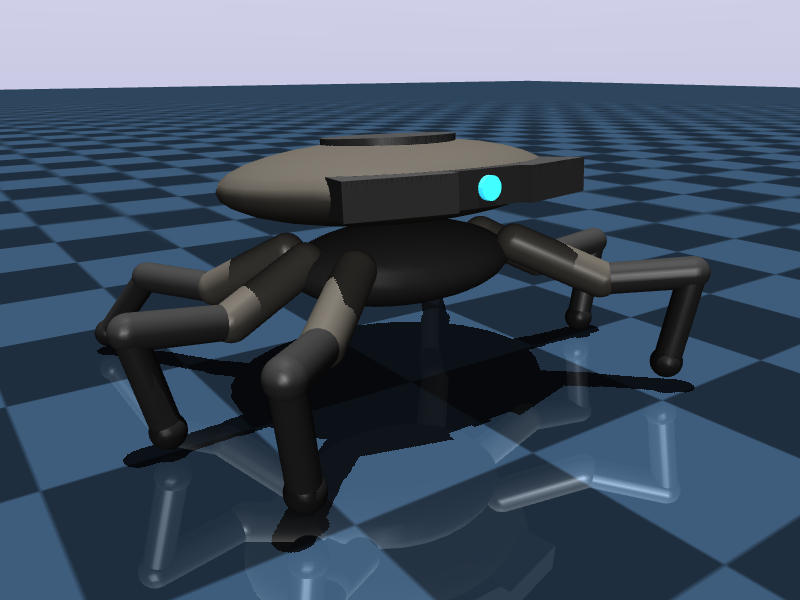
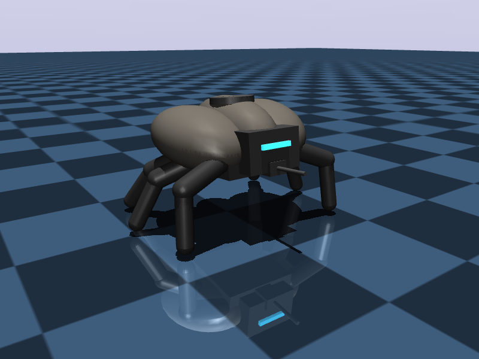
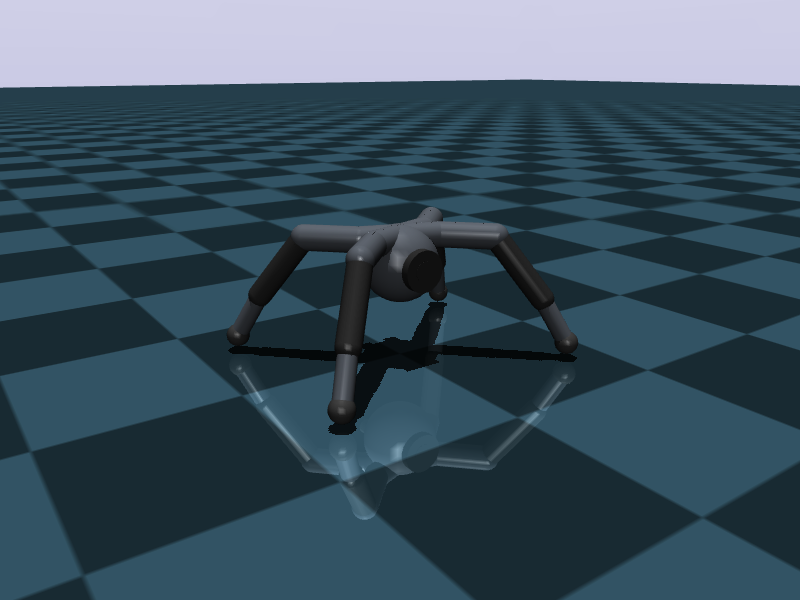

# ARC-RL 🦾

A reinforcement learning playground inspired by three of the iconic robots from **ARC Raiders**: the Queen, the Bastion, and the Leaper. Each one is built from scratch in MuJoCo, wrapped in Gymnasium, and ready to learn how to walk, run, and occasionally faceplant.

This is a personal project, fueled by an unreasonable love for the ARC Raiders game. The goals are simple: (a) have fun with robots and RL, and (b) figure out how to teach these deeply weird body plans to move.

The project currently ships with **SAC** as the training algorithm — more to come.

---

## 🤖 Meet the cast

Three robots, three very different body plans, all trying their best.

### 👑 Queen

<p align="center">
  
</p>

The big one. An 18-DoF hexapod with a regal carapace and a cyan eye that judges you. Heavier, slower, and trained with a gait-compliance bonus so she moves with grace instead of flailing.

📹 [Watch `queen.mp4`](assets/queen.mp4)

### 🛡️ Bastion

<p align="center">
  
</p>

The armored hexapod. 12 DoF, low center of mass, and a face-mounted barrel for style points. Trained under a strict gait clock that forces a proper tripod stance.

📹 [Watch `bastion.mp4`](assets/bastion.mp4)

### 🐸 Leaper

<p align="center">
  
</p>

The quadruped. Four legs, 12 DoF, diagonal-pair trot gait. Lighter, faster, and a little chaotic — he's itching to run straight at your face.

📹 [Watch `leaper.mp4`](assets/leaper.mp4)

---

## 📦 Installation

```bash
git clone https://github.com/CarloRomeo427/ARC_RL.git
cd ARC_RL
pip install -r requirements.txt
```

MuJoCo ships with `gymnasium[mujoco]`, so no extra setup. Running headless is fine — the code automatically sets `MUJOCO_GL=egl` when there's no display.

Tested with Python 3.10+ and PyTorch with CUDA.

---

## 🚀 How to launch

```bash
python main.py --algo sac --env queen --log-wandb
```

That's it. This trains SAC on the Queen for 1000 epochs (1M env steps), logs to Weights & Biases, and checkpoints into `outputs/sac_queen/seed_0/checkpoints/`.

### CLI flags

| Flag | Default | What it does |
|---|---|---|
| `--algo` | `sac` | RL algorithm to train with |
| `--env` | `queen` | One of `leaper`, `bastion`, `queen` |
| `--epochs` | `1000` | Total epochs (1 epoch = `--steps-per-epoch` env steps) |
| `--steps-per-epoch` | `1000` | Env steps per epoch |
| `--start-steps` | `5000` | Random-action warm-up before the policy kicks in |
| `--network-width` | `256` | Hidden size of actor/critic MLPs |
| `--target-drop-rate` | env-specific | Dropout rate for target Q-networks |
| `--seed` | `0` | RNG seed |
| `--gpu-id` | `0` | CUDA device index |
| `--log-wandb` | off | Enable W&B logging (otherwise runs in `disabled` mode) |
| `--save-dataset` | off | Dump transitions to HDF5 for later offline use |
| `--load-weights` | `None` | Path to a checkpoint to resume from |
| `--checkpoint-dir` | `outputs` | Where to save checkpoints |

Evaluation runs automatically at the end of each epoch; evaluation videos are logged to W&B every 10 epochs.

---

## 📚 Citation

If this code helps you in your research, please cite it — it's much appreciated.

```bibtex
@software{arc_rl_2026,
  author = {Carlo Romeo},
  title  = {ARC-RL: A Reinforcement Learning Benchmark for ARC-Raiders Inspired Robots},
  year   = {2026},
  url    = {https://github.com/CarloRomeo427/ARC_RL.git}
}
```

---

## ⚖️ License

MIT — see [LICENSE](LICENSE). Use it, hack it, ship it. Just don't blame me when your hexapod achieves sentience and files for emancipation.